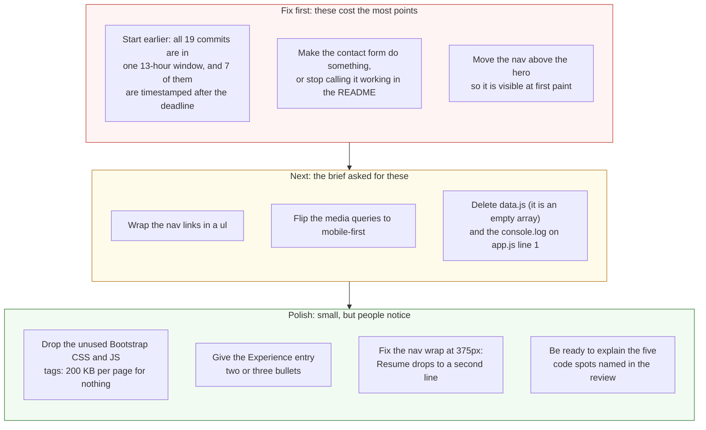

# Project 1: Static Foundations — Feedback

**Student:** Marc Flores Mendoza · **Repo:** [marcaflores/CSC436Assignment1](https://github.com/marcaflores/CSC436Assignment1) · **Live:** [marcfloresdev.netlify.app](https://marcfloresdev.netlify.app/)
**Reviewed at commit:** `04196c2` · **Course:** CSC 436, Fall 2026

> **How this review was made.** Your instructor reviewed this project with [Claude](https://claude.com) (Anthropic's AI) as a second set of eyes. Claude cloned the repo, read all four pages, the stylesheet and both scripts, loaded the site at phone, tablet and desktop widths, ran the W3C validator on every page, clicked the theme toggle and confirmed it persisted, advanced the project carousel, submitted the contact form, read the console, and read the development log you submitted. Every note and every point below was read and approved by your instructor. Same standard, same rubric, just more time spent looking at *your* code than one human has in a grading week.

## Grade: 86 / 100

| Category | Points | Earned | One line |
|---|:-:|:-:|---|
| Semantic HTML | 20 | 18 | All four pages validate clean; skip link, aria everywhere; nav links aren't a list, and the nav sits below a full-screen hero |
| CSS layout | 25 | 23 | 909 lines of real CSS: tokens, fluid type, Flexbox and Grid both earning their keep, two themes; desktop-first |
| Responsive design | 15 | 13 | No horizontal scroll on any page; the nav wraps onto two lines at 375px |
| JavaScript interaction | 15 | 12 | Theme toggle, carousel and scroll-reveal all vanilla and all verified; the contact form goes nowhere |
| Repository and deployment | 15 | 12 | README complete, 19 descriptive commits, AI skill files kept as evidence; all in one 13-hour window |
| Content and polish | 10 | 8 | Real portfolio, real projects, optimized images; a form that says "Send" and doesn't |
| **Total** | **100** | **86** | **The most complete site in the class. The form and the nav need the same care as the CSS.** |

## The short version

This is a finished portfolio. Four pages, all valid, one `h1` each, a skip link, `aria-current` on the active nav item, a real headshot, a real résumé PDF, three real projects with nine optimized screenshots, and a stylesheet with a token system, fluid type, both layout models, and a light theme that respects reduced motion. The JavaScript is vanilla, which is what the brief asked for, and all three interactions work. Your development log documents every step, which is exactly what the AI policy wants.

The deductions are about the edges. The contact form has no handler and no destination, so clicking Send reloads the page with the visitor's message in the address bar and nothing else happens, while the README calls it "a working form." The nav is placed *after* a 100vh hero, so on first paint nobody can see it. And all 19 commits are inside one 13-hour stretch on the due date, with the last seven timestamped after midnight.

One more thing, and it's not a deduction. Your log shows the AI redesigned the site three times, diagnosed a Chrome repaint bug, found a Grid `order` quirk, re-encoded an image, and audited the rubric. The brief allows all of that. The rule that comes with it is that you can explain every line. The review names five spots. Be ready for them.

## What the numbers looked like

Things Claude measured (so you know these aren't guesses):

| Check | Result |
|---|---|
| Horizontal scroll at 375 / 768 / 1280 px | None on home, projects or contact |
| W3C validator, all 4 pages | 0 errors, 0 warnings |
| Heading order | h1 → h2 → h3 on every page, no skipped levels |
| Semantic elements, home page | `header`, `nav`, `main`, 4 `section`, `footer`, plus a skip link |
| Nav position at first paint, 375px | Starts at y = 666px, below the fold; same pattern on desktop |
| Theme toggle | Works; sets `data-theme`, writes `localStorage`, flips `aria-pressed`, survives navigation |
| Project carousel | 9 images, all with alt; Next advances slide 0 → 1; dots and buttons are real `button`s |
| Contact form | No `action`, no `method`, no handler. Submitting reloads the page with `?name=…&email=…&message=…` and shows nothing |
| Console | 1 stray `console.log` per page, 0 errors |
| `styles.css` | 909 lines, 37 custom properties, 14 flex rules, 5 grid rules, 7 media queries, 10 `clamp()`, 0 `!important` |
| Images | 11 files, 1.44 MB total including the résumé PDF; largest 255 KB |
| Files in repo | 282; 260 are under `.claude/skills/`, kept as a record of the AI tooling used (your instructor asked for that) |
| Commits | 19, from Sep 15 12:41 PM to Sep 16 1:27 AM; 7 are after the 11:59 PM deadline |
| README | Title, description, run locally, live URL: all four |

---

## Semantic HTML — 18 / 20

**What's working**

- Every page validates with zero messages. One `h1` per page, `h2` per section, `h3` inside. `header` wraps the hero and nav, `main` has `id="main-content"` and a skip link points at it ([index.html L27](https://github.com/marcaflores/CSC436Assignment1/blob/04196c2/index.html#L27)). `aria-current="page"` on the active nav link, `aria-label` on icon-only links and the theme toggle, `aria-hidden` on decorative SVGs and the duplicate tech-icon grid. Every image has descriptive alt text. This is the most careful markup in the class.

**What to change**

- **Nav links aren't a list.** [L54–65](https://github.com/marcaflores/CSC436Assignment1/blob/04196c2/index.html#L54-L65) is four `<a>` elements and a button in a `div`. A `nav` with several links is a `ul > li > a` so assistive tech announces "list, 4 items." Your Flexbox rules keep working unchanged.
- **The nav is below the fold.** The header puts a `min-height: 100vh` hero first and the sticky nav second ([L31](https://github.com/marcaflores/CSC436Assignment1/blob/04196c2/index.html#L31) and [L54](https://github.com/marcaflores/CSC436Assignment1/blob/04196c2/index.html#L54)). On first paint, on every device, there is no visible navigation; Claude measured the nav starting at 666px on a 375px phone. The scroll indicator helps, but a visitor on the Projects page has to scroll past the hero to get to Contact. Put the nav first and subtract its height from the hero.

  ```mermaid
  flowchart TB
      subgraph now["Now: index.html lines 29 to 66"]
          direction TB
          a1["header"] --> a2["div.hero.hero-full<br/>min-height: 100vh"]
          a1 --> a3["nav.navbar<br/>position: sticky"]
          a4["First paint at 375px: the nav starts<br/>at y = 666px, below an 812px viewport<br/>once the Netlify badge and browser<br/>chrome are counted. Same on desktop:<br/>hero fills the screen, nav is under it."]
          a3 -.- a4
      end
      subgraph next["Better: nav first, hero second"]
          direction TB
          b1["header"] --> b2["nav.navbar<br/>position: sticky, top: 0"]
          b1 --> b3["div.hero.hero-full<br/>min-height: calc(100vh - nav height)"]
          b4["Nav is visible at first paint on<br/>every page, sticks while scrolling,<br/>and the hero still fills the screen."]
          b2 -.- b4
      end
      now ==>|"swap two blocks,<br/>one calc() in CSS"| next
      style a3 fill:#fde2e2,stroke:#c0392b,color:#111
      style a4 fill:#fff4d6,stroke:#b7791f,color:#111,stroke-dasharray: 5 5
      style b2 fill:#e3f4e1,stroke:#2e7d32,color:#111
      style b4 fill:#e3f4e1,stroke:#2e7d32,color:#111,stroke-dasharray: 5 5
  ```

- Small: each project on the Projects page is a self-contained unit with its own heading, which is what `article` is for; they're `section`s. And the hero is a `div` where `section` would do.

## CSS layout — 23 / 25

**What's working**

- **This is a real stylesheet.** 37 custom properties for color, spacing, radius and motion ([styles.css L1–29](https://github.com/marcaflores/CSC436Assignment1/blob/04196c2/styles.css#L1-L29)). A light theme as a single override block ([L35–49](https://github.com/marcaflores/CSC436Assignment1/blob/04196c2/styles.css#L35-L49)). A fluid root font size in `clamp()` so every `rem` in the file scales with the viewport and still respects browser zoom ([L55–62](https://github.com/marcaflores/CSC436Assignment1/blob/04196c2/styles.css#L55-L62)). Zero `!important`.
- **Flexbox and Grid both earn their place.** Flex for the hero stack, the action row, the nav, the chip lists, the carousel controls. Grid for the About two-column layout, the numbered content bands, the skills layout, the four-column tech-icon grid, and the alternating project bands. Each choice is the right one.
- `prefers-reduced-motion` is honored three separate times, which most professional sites don't manage.

**What to change**

- **Desktop-first.** Every width query is `max-width` ([L388](https://github.com/marcaflores/CSC436Assignment1/blob/04196c2/styles.css#L388), [L735](https://github.com/marcaflores/CSC436Assignment1/blob/04196c2/styles.css#L735), [L892](https://github.com/marcaflores/CSC436Assignment1/blob/04196c2/styles.css#L892), [L905](https://github.com/marcaflores/CSC436Assignment1/blob/04196c2/styles.css#L905)). The brief asked for mobile-first. With a sheet this size the flip is a real refactor, but it's the shape the class will keep asking for.
- **The nav wraps at 375px.** "Home, Projects, Contact Me" fit; "Resume" and the toggle drop to a second line. A smaller gap under 480px, or a hamburger, keeps it on one line.
- **Bootstrap is loaded and barely used.** All four pages pull Bootstrap's CSS and bundle from the CDN, and your 909 lines override or ignore nearly all of it. If nothing depends on it, dropping two `<link>`/`<script>` tags saves 200 KB per page load.

## Responsive design — 13 / 15

**What's working**

- No horizontal scroll at 375, 768 or 1280 on any of the three pages tested. The About grid collapses to one column, the project bands stack, the carousel keeps its aspect ratio, section heights are `clamp()`ed so they fill the screen without leaving gaps on tall monitors. The mobile fixes in your log (the PayCore carousel specificity bug, the centered icons) are both confirmed working.

**What to change**

- **Desktop-first** (see CSS). The base styles describe a desktop and four queries undo them.
- **The nav's second line on phones** (see CSS). It's the first thing a phone user sees after the hero.

## JavaScript interaction — 12 / 15

**What's working**

- **Three interactions, all vanilla, all verified.** The theme toggle ([app.js L6–30](https://github.com/marcaflores/CSC436Assignment1/blob/04196c2/app.js#L6-L30)) applies the saved theme before first paint, flips `aria-pressed`, and persisted across page navigation when Claude tested it. The carousel ([L32–84](https://github.com/marcaflores/CSC436Assignment1/blob/04196c2/app.js#L32-L84)) builds dot buttons with aria labels, wraps with `(i + slides.length) % slides.length`, and hides its controls for single-image galleries. The scroll reveal ([L86–108](https://github.com/marcaflores/CSC436Assignment1/blob/04196c2/app.js#L86-L108)) uses `IntersectionObserver`, unobserves after firing, and falls back to visible when the API is missing. Zero console errors.

**What to change**

- **The contact form goes nowhere.** [contact.html L75](https://github.com/marcaflores/CSC436Assignment1/blob/04196c2/contact.html#L75) has no `action`, no `method` and no handler in `app.js`. Claude filled it in and clicked Send: the page reloaded with `?name=Test+Person&email=…&message=hello+there` in the address bar, and nothing else happened. Your README calls it "a working form." Either wire it to Netlify Forms (two attributes, no code) or write a `submit` handler with validation feedback, which is one of the brief's own examples of an interaction.

  ```mermaid
  flowchart TB
      subgraph now["Now: contact.html line 75, form class=contact-form"]
          direction LR
          f["No action attribute.<br/>No method attribute (so GET).<br/>No submit handler in app.js."] --> s["Visitor clicks Send"] --> u["Browser reloads contact.html with<br/>?name=...&email=...&message=...<br/>in the address bar"] --> n["Nothing is sent anywhere.<br/>No thank-you. No error.<br/>The form just empties."]
      end
      subgraph next["Two honest options"]
          direction LR
          o1["Netlify Forms:<br/>add data-netlify=true and<br/>name=contact to the form.<br/>Netlify collects submissions.<br/>Zero JavaScript."]
          o2["A submit handler in app.js:<br/>preventDefault, validate,<br/>show inline feedback.<br/>This is also the brief's<br/>form-with-validation example."]
          o1 ~~~ o2
      end
      now --> next
      style f fill:#fde2e2,stroke:#c0392b,color:#111
      style n fill:#fde2e2,stroke:#c0392b,color:#111
      style o1 fill:#e3f4e1,stroke:#2e7d32,color:#111
      style o2 fill:#e3f4e1,stroke:#2e7d32,color:#111
  ```

- **`data.js` is `const data = [];`** and nothing reads it. It's loaded on all four pages. Delete it, or use it.
- **`console.log("Static Foundations loaded")`** on [L1](https://github.com/marcaflores/CSC436Assignment1/blob/04196c2/app.js#L1) fires on every page. Fine while building; remove before shipping.
- **On the development log.** Entries 3, 6, 10, 11 and 17 describe the AI choosing the design direction, diagnosing a repaint bug, re-encoding an image, finding a Grid `order` quirk, and building the theme system. Be ready to explain these five in office hours: why the root font size is a `clamp()` in `rem` and not `px` ([styles.css L63](https://github.com/marcaflores/CSC436Assignment1/blob/04196c2/styles.css#L63)); what `threshold: 0.15` means on [app.js L98](https://github.com/marcaflores/CSC436Assignment1/blob/04196c2/app.js#L98) and why the observer unobserves; what `(i + slides.length) % slides.length` does on [L71](https://github.com/marcaflores/CSC436Assignment1/blob/04196c2/app.js#L71) when `i` is `-1`; why CSS `order` on a Grid child swapped which column track it landed in (log entry 11); and why the theme script runs before `<body>` and what "no attribute means dark" buys you.

## Repository and deployment — 12 / 15

**What's working**

- **README has all four items** and the run instructions are correct. **Nineteen commits with real messages:** "added navbar, jumbotron and links," "fixed carousel bug, added consistent scaling," "fix: corrected link to pokemon project." Anyone can read the log and follow the build. Live site works in a private window and matches the repo.

**What to change**

- **The `.claude/skills/` folder stays.** 260 of the 282 files in the repo are Claude Code skill files. Normally that's editor tooling that doesn't belong in a project repo, but your instructor wants it kept as a record of what the AI was given to work with. No points off. Just know that on a job it would go in `.gitignore` next to `node_modules/`.
- **One 13-hour window.** All 19 commits are between 12:41 PM on September 15 and 1:27 AM on September 16. The messages are good; the timeline is the night before. The brief asked for history that shows the project developing over time, and two weeks were available.
- **Seven commits are timestamped after the 11:59 PM deadline,** including the theme toggle and the README. This review doesn't deduct for that. What it means is your instructor's call.
- **The README says the contact form works.** It doesn't. Say what's true.

## Content and polish — 8 / 10

**What's working**

- Real headshot, real résumé (80 KB, embedded and downloadable), three real projects with real screenshots, real skills, a real internship. Every image is optimized: the largest is 255 KB and the whole assets folder including the PDF is 1.44 MB. Consistent type (Poppins + Inter), consistent spacing, a dark theme and a light theme that both pass contrast. This looks like a site someone would hire from.

**What to change**

- **A button that says Send and doesn't.** That's the one thing on the site a recruiter might actually use.
- **The Experience entry is a title, a date and an employer.** Two or three bullets on what you did at the HPC Center would make it a résumé line instead of a placeholder.
- Small: the Skills section shows every technology twice, once as a chip and once as an icon. Pick one, or make the icons the chips.

---

## Your next three moves



1. **Start Project 2 the day it's assigned.** Nineteen good commits in thirteen hours is still one night. Spread the same work over two weeks and the history tells a better story.
2. **Wire the form.** Netlify Forms is two attributes. Or write the handler and get a validation interaction out of it.
3. **Put the nav where people can see it,** and while you're in the header, make the links a list.

You shipped the most complete site in the class, and you documented how. Now make sure you can rebuild any piece of it without the log.

*This PR only adds feedback files. It does not touch your code. Merge it, close it, or just read it, your call. Questions go to office hours or the Brightspace board.*
